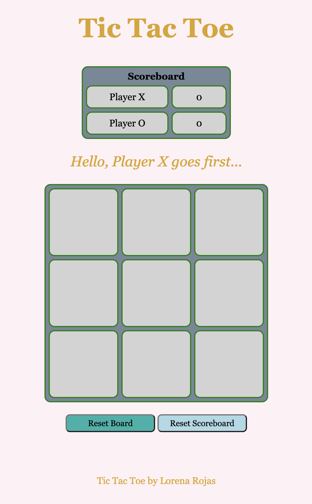

# tic-tac-toe

## Overview:

This is a two player tic-tac-toe game built using HTML, CSS, and Javascript. 

## Technologies used:
* HTML5, CSS, Javascript - To build the game
* Chrome/ Chrome Developer Tools - Debugging
* VSCode - Text editor

## Features:
* Player's are able to start a new game by refreshing the page or resetting the board button
* Player 1 starts with X and Player 2 starts with O
* A message displays after each player's turn
* Player's are not able to click on the same button twice
* Player's are not able to continue playing once a player wins, loses, or if there's a draw
* A message displays stating which player won or if the game ended in a draw
* Scoreboard updates after each win
* Player's are able to reset the board and scoreboard separately 

## Getting Started:
Click [here](https://lrojas4.github.io/tic-tac-toe/) to play! 

## Future Features:
* Highlights the winning buttons
* Players are able to input their name
* Each player is able to choose between X or O